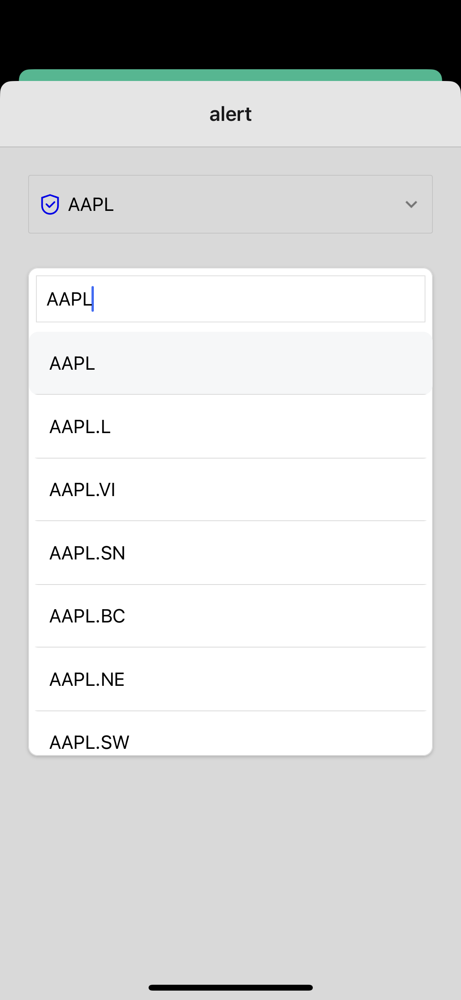

# Stocks & Watchlist App: React Native App

Mobile application developed with **React Native**.

An app that connects with **Finnhub API** to allow users to search for stocks, add them to a watchlist, and create price alerts for stocks.


## Table of Contents
- [Screenshots](#screenshots)
- [Demo (Gifs)](#demo-gifs)
- [Structure](#structure)
- [Features](#features)
- [Prerequisites](#prerequisites)
- [Dependencies](#dependencies)
- [Installation](#installation)
- [License](#license)

## Screenshots (iOS)

&nbsp;&nbsp;&nbsp;&nbsp;

## Screenshots (Android)

&nbsp;&nbsp;&nbsp;&nbsp;


## Structure

- `components`: Essential, reusable building blocks like the stock card and dropdown.
- `app`: Where the tabs and layout is placed, using expo-router
- `hooks`: Reusable hooks to connect the app with the Finnhub API endpoints and handle real-time data.
- `utils`: Utility functions, such as storage utilities for persistent state.
- `context`: React context files.


## Features
The current application offers:

- **Stock Search**: Search for stocks using the Finnhub API.
- **Watchlist Management**: Add stocks to a watchlist and remove them as needed.
- **Price Alerts**: Create price alerts for stocks and receive notifications when the stock price exceeds the alert price.
- **Real-time Data**: Receive real-time stock data updates from Finnhub.

## Prerequisites
Ensure you have met the following requirements:

* You have installed the latest version of:
  * `yarn`
  * `.nvmrc`

## Dependencies
The following major dependencies are used in the project:

- React (`react: 18.2.0`) 
- React Native (`react-native: 0.73.6`) as the main frameworks for building the app interface.
- Expo Development Build (more info: [Expo Development Builds](https://docs.expo.dev/develop/development-builds/create-a-build/)) for creating a custom development build.
- GlueStack-io (more info: [GlueStack.io](https://gluestack.io/)) for UI components.
- react-native-notifier (`react-native-notifier: ^1.0.0`) for in-app notifications.
- Finnhub API (more info: [Finnhub API](https://finnhub.io/)) for stock data.

## Installation
Describe the installation process. Include the step-by-step process.

```bash
# Clone this repository
$ git clone git@github.com:jtvargas/stocks-rn.git

# Go into the repository
$ cd stocks-rn

# Install dependencies
$ yarn install

# Start the server
$ yarn start
```

**Prerequisites**: Ensure your environment is set up for React Native development. Follow the Expo documentation for setting up development builds.

### Run the app (**Simulator**)

**iOS**
- Run `yarn ios`

For physical device use Xcode.

**Android**
- Run `yarn android`

## License
Copyright 2024 © Jonathan Taveras
